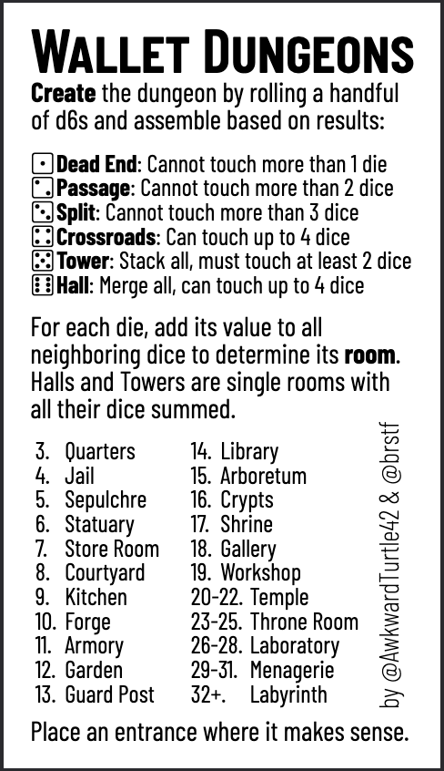
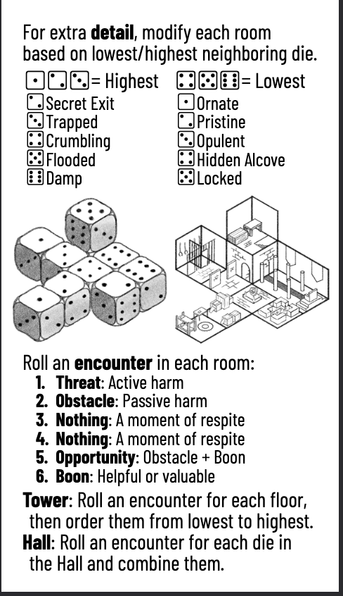

# Going Rogue with Metamodern Perl
^- Clean Setup - Set Expectations
^	- Class is about indie Game building
^	- Perl is incidental but like why we are here
^	- Same basic process works in any language, some languages just have better tools
^	- Don’t write games for Steam like this, use Unity/Unreal/Godot

---

# What are you looking for in this class?

---

[.build-lists: true]

# Expectations

* This is a class about building Video Games, we just happen to be using Perl
* You won't make a game ready for Steam
* You will build something

---

# A Quick and Dirty Game

 

<sub>Wallet Dungeons: https://awkwardturtle.itch.io/wallet-dungeons</sub>

---

# How it works

## Dice Rolls

```
Roll 20d6:
1 1 1 2 2 2 2 2 3 4 4 5 5 5 5 5 6 6 6 6
```

## A Map

```
      [1]
      [2]   [6][6]
[1][2][4][2][6][6]
      [2]   [2]
   [1][3][5][4]
```

^ The four 6s are Halls and can be joined together to form a single room
^ The five 5s are Towers and can be stacked atop each other
^ The two 4s are Crossroads and can join up to 4 other rooms
^ The one 3 is a Split and can join up to 3 other rooms
^ The five 2s are Passages and can join up to 2 other rooms
^ The three 1 is a Dead End and can only touch one other room

---

# Encounters

```
Roll 20d6:
5 3 6 6 1 6 6 1 5 2 6 3 3 1 2 1 5 4 4 4
```

## The Map

```
      [e]
      [d]   [ l  ]
[a][b][c][i][    ]
      [f]   [k]
   [h][g][T][j]
```
^ Room a: 5 => Opportunity: Obstacle + Boon
^ Room b: 3 => Nothing
^ Room c: 6 => Boon
^ Room d: 6 => Boon
^ Room e: 1 => Threat: Active Harm
^ Room f: 6 => Boon
^ Room g: 6 => Boon
^ Room h: 1 => Threat: Active Harm
^ Room i: 5 => Opportunity: Obstacle + Boon
^ Room T: 2,6,3,3,1,2  => Sorted smallest to largest => Threat, Obstacle, Obstacle, Nothing, Nothing, Boon
^ Room k: 1 => Threat: Active Harm
^ Room l: 5,4,4,4 => Opportunity,, Nothing, Nothing, Nothing

---

# Let's turn it into a Video Game

Clone the template repo for this class:

https://github.com/perigrin/going-rogue-class

^The template repo just gives you a bare bone game loop
^If you were in the Overview class it should look familiar

---

# First we add a map ...

```perl
class Map {
    field $tile_size :param = 10;

    field @tiles =
      map { chomp; [ split //, $_ ] } map { split /\n/, $_ } <<~'END_MAP';

        [ YOUR MAP HERE ]

     END_MAP

    method print () {
        for my $row (@tiles) {
            say join '', @$row;
        }
    }
}
```
---

# ... To the Game

Just add the following to your Game class:

```perl
    field $map = Map->new(tile_size => $size);
```

And update the render method to include the map:

```perl
method render() {
    $app->clear();
    $app->draw_objects($map, $player);
}
```
---

# Back in the map class we need a draw

```perl
method draw() {
    for my $y ( 0 .. $#tiles ) {
        my $row = $tiles[$y];
        for my $x ( 0 .. $#$row ) {
            if ( $row->[$x] eq '#' ) {
                $wall_glyph->draw( $x * $tile_size, $y * $tile_size );
            }
        }
    }
}

```
---
# We forgot the wall glyph

```perl
field $wall_glyph = Raylib::Text->new(
    text  => '#',
    color => Raylib::Color::GRAY,
    size  => $tile_size,
);
```
---

# There's a problem still
## ... we can walk through walls

We'll update the MoveAction to prevent walking through walls.

```
method execute( $target, $map ) {
    my ( $x, $y ) = $target->location;
    unless ( $map->is_wall( $x + $dx, $y + $dy ) ) {
        $target->move( $dx, $dy );
    }
}
```

And  update our call to `execute()` to include the map:

```perl
method update() {
    $_->execute( $player, $map ) for @actions;
    @actions = ();
}
```

---

# Now we add our Boons, Threats, and Obstacles

---


```perl
field @entities = ();

my $add_boon = method(%config) {
    push @entities, => Entity->new(
        %config,
        icon => 'B',
        size => $size
    );
}

ADJUST {
    for (qw(c d f g)) {
        $self->$add_boon(location => $map->spawn_point($_));
    }
}
```

Repeat for Threats and Obstacles.

---

# ... the spawn points

```perl
field %spawn_points = ();
ADJUST {
    for my $y ( 0 .. $#tiles ) {
        my $row = $tiles[$y];
        for my $x ( 0 .. $#$row ) {
            next unless $row->[$x] =~ /[a-zA-Z]/;
            my $label = $row->[$x];
            $spawn_points{$label} = [ $x * $tile_size, $y * $tile_size ];
        }
    }
    $spawn_points{'entrance'} = [ 3 * $tile_size, 28 * $tile_size ];
}

method spawn_point($name) {
    my $point = %spawn_points{$name};
    return $point;
}

method entrance() { $spawn_points{'entrance'} }
```

---

# Make the boons, threats, and obstacles more interesting

```perl
class InventoryComponent {
    field @stuff;
    method add($thing) { push @stuff => $thing }
    method all() { @stuff }
}

class HealthComponent {
    field $hp : param : reader = 5;
    method update_hp($delta) { $hp += $delta }
    method is_dead()         { $hp >= 0 }
}

class CombatComponent {
    field $str : param = rand(9) + 1;
    field $armor : param : reader = rand(3) + 1;

    method attack() { $str }
}
```

---

# Taking Things

```perl
class TakeAction {

    field $target : param;

    method execute( $taker, $map, $game ) {
        $taker->get_component('InventoryComponent')->add($target);
        $game->remove_entity($target);
        $game->log( $taker->icon . " picked up " . $target->icon );
    }
}
```

---

```perl
field $components : param = {};

method add_component($component) {
    $components->{ builtin::blessed($component) } = $component;
}

method remove_component($component) {
    if ( blessed($component) ) {
        $component = blessed($component);
    }
    delete $components->{$component};
}

method get_component($component) {
    if ( blessed($component) ) {
        $component = blessed($component);
    }
    return $components->{$component};
}

```
---

```perl
class MoveAction {
    field $dx : param = 0;
    field $dy : param = 0;

    method execute( $target, $map, $game ) {
        my ( $x, $y ) = $target->location->@*;
        return if $map->is_wall( $x + $dx, $y + $dy );
        if ( my $entity = $game->entity_at( $x + $dx, $y + $dy ) ) {
            $game->add_action( TakeAction->new( target => $entity ) );
            return;
        }
        $target->move( $dx, $dy );
    }
}
```


---

- ProcGen
	- Port of Business Card Generator
	- Cyclical Generator
	- Wave Function Collapse
	- Point to RLTK modules for other kinds of layouts

---

- Game Design Theory
  - Game Design Principles
  - Narrative Level Design
  - designing with systems

---

- ECS/Game Engine/Loop
	- Organizational
	- Data Oriented Design
	- Sparse Arrays / Archtypes
	- Focus on the kinds of data in your game c.f. Boids problem

---

- AI NPCs & Mobs (HTN)
	- Simple FSMs
	- Behavior Trees
	- Hierarchical Task Networks
